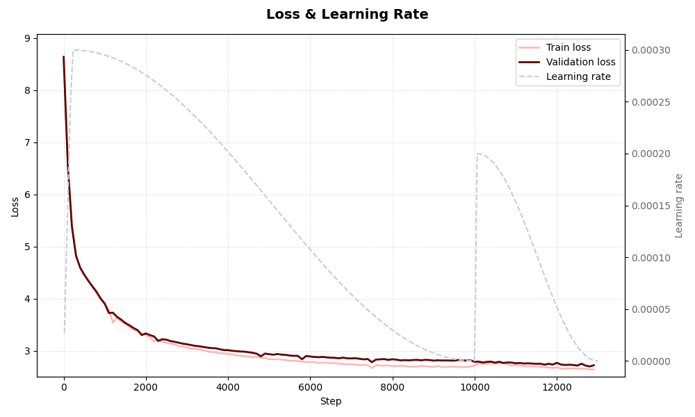

# Mistral-MiniLLM_2025

**Mistral-MiniLLM_2025** est un projet d'apprentissage et découverte personnel visant à coder et entraîner un **petit modèle de langage français** inspiré des architectures modernes (GPT-like) mais entraînable localement.

Motivations :
- comprendre les mécanismes internes et d’un LLM ainsi que ce qui gravite autour (tokenizer, architecture, entraînement, génération) ;
- essayer à l'avenir d'en faire un mini agent conversationnel.

---

## Le pojet actuellement

- **Corpus propre, diversifié et reproductible** (30M caractères).
- **Tokenizer BPE** adapté au français (littéraire, conversationnel, théâtre, dialogues restranscrits) avec gestion de tokens spéciaux pour les rôles user/agent.
- Entraînement du **LLM** (16M paramètres) sur laptop personnel.
- Pipeline complet : **prétraitement → tokenisation → entraînement → génération**.

---

## Fonctionnalités principales

### **Corpus** (`create_corpus.py`)
- Extraction de sources publiques (théâtre, dialogues, littérature courte).
- Nettoyage, normalisation, segmentation.

### **Tokenizer BPE** (`tokenizer.py`)
- Adapté d'un tutoriel d'Andrej Karpathy.
- Construction d’un vocabulaire optimisé pour le français.
- Export du vocabulaire et des merges pour réutilisation sous format JSON.

### **Modèle** (`model.py`)
- Adapté d'un tutoriel d'Andrej Karpathy.
- Architecture d'un petit transformer basé sur la self-attention :
  - embeddings
  - multi-head attention
  - feed-forward
  - normalisation
- Taille adaptable depuis `config.py`.

### **Entraînement** (`main_train.py`)
- Gestion des checkpoints.
- Suivi de la loss avec TensorBoard.

### **Génération**
- Script provisoire pour tester le modèle entraîné.

---

## Résultats d’entraînement 

<p align="center">
  
</p>

Le training s'est effectué en deux sessions (10 000 itérations puis 3 000 avec un nouvel optimizer, un LR plus faible).

Cette première version montre un apprentissage indéniable du modèle, mais un plateau à **2.7 après 13 000 itérations** pour la validation loss est **surprenant**. En effet, dans son tutoriel, Karpathy descend aux alentours de 1.5 en 5 000 itérations pour des paramètres similaires. Les raisons possibles (ce qui diffère entre sa version et la mienne) :

- mon corpus est **très diversifié et certainement pas assez propre** -> c'est une priorité ;
- un **tokenizer BPE contenant un bug**, puisqu'il merge les tokens spéciaux (<|doc|>) -> seconde priorité.

Le modèle (~16M paramètres) montre des balbutiements de français qui apparaissent plausible.


### Le futur fine‑tuning

Fine-tuner après cet entraînement est inenvisageable selon moi. Il faut d'abord corriger les problèmes mentionnés ci-dessus et peut-être faudra-t-il scale-up le modèle et l'entraîner sur une machine dédiée (CUDA) pour avoir un début de cohérence dans les propos. Cela n'est sûrement pas accessible pour un modèle de 16 M de paramètres.

---

## Comment lancer le projet

Voici les étapes pour reproduire l’entraînement ou tester le modèle :

### 1. Générer le corpus  
```bash
python create_corpus.py
```
Crée un corpus dans `corpus_docs/`.

### 2. Entraîner le modèle  
```bash
python main_train.py
```
- Entraîne le tokenizer si nécessaire  
- Prépare le dataset  
- Lance l’entraînement du LLM  
- Sauvegarde checkpoints et logs TensorBoard

### 3. Générer du texte avec le modèle entraîné  
```bash
python generate.py
```
Permet de tester la génération.


