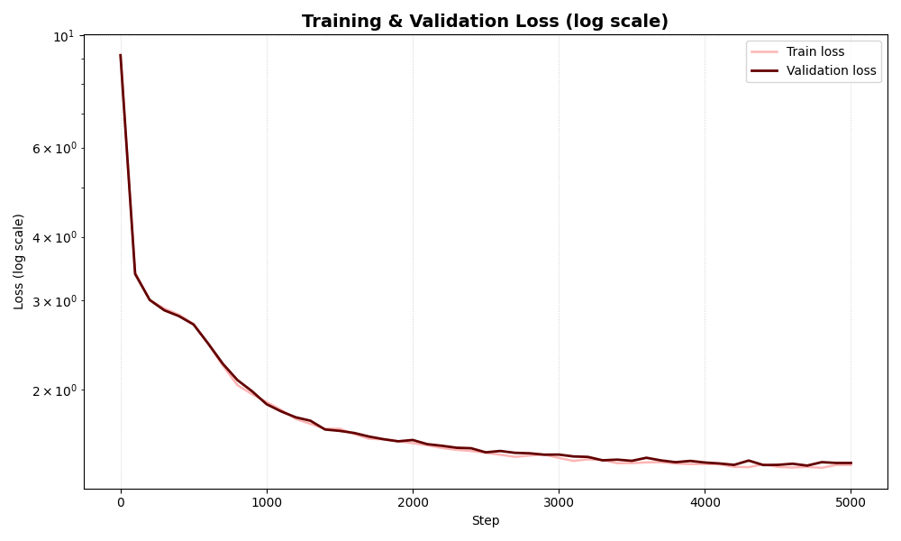
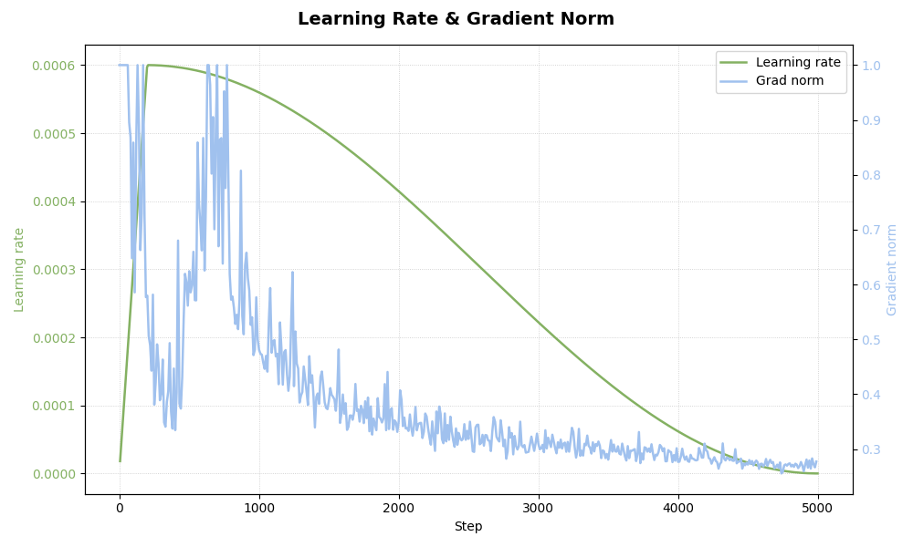

# Mistral-MiniLLM_2025

**Mistral-MiniLLM_2025** est un projet d'apprentissage et découverte personnel visant à coder et entraîner un **petit modèle de langage français** inspiré des architectures modernes (GPT-like). Par la suite, j'essayerai de le fine-tuner et adapter à un mode plus conversationnel.

Motivations :
- comprendre les mécanismes internes et d’un LLM ainsi que ce qui gravite autour (tokenizer, architecture, entraînement, génération) ;
- essayer à l'avenir d'en faire un mini agent conversationnel.

---

## Le pojet actuellement

- **Corpus propre, diversifié et reproductible** réparti en 5000 fichiers (140 Mo de texte de Wikipédia, classiques du théâtre et de la littérature).
- **Tokenizer BPE** adapté au français avec gestion de tokens spéciaux pour les rôles user/agent.
- Entraînement du **LLM** (16M paramètres) sur laptop personnel (upscale envisageable mais sur machine dédiée...).
- Pipeline complet : **prétraitement → tokenisation → entraînement → génération**.

---

## Fonctionnalités principales

### **Corpus** (`create_corpus.py`)
(Nouvelle version -> corpus 10x plus massif et encore plus normalisé)
- Extraction de sources publiques (théâtre, dialogues, littérature courte).
- Nettoyage, normalisation, segmentation (codé à l'aide de l'IA car l'étape de normalisation est en réalité très complexe).


### **Tokenizer BPE** (`tokenizer.py`)
(Nouvelle version -> fix des bugs de merges inutiles.)
- Adapté d'un tutoriel d'Andrej Karpathy.
- Construction d’un vocabulaire optimisé pour le français.
- Gestion des caractères spéciaux + tokens spéciaux qui pourront servir pour le fine-tuning et le mode 'agent conversationnel'.
- Export du vocabulaire et des merges pour réutilisation sous format JSON.

### **Modèle** (`model.py`)
(Nouvelle version -> Ajout d'un paramètre de température pour la génération)
- Adapté d'un tutoriel d'Andrej Karpathy.
- Architecture d'un petit transformer basé sur la self-attention :
  - embeddings
  - multi-head attention
  - feed-forward
  - normalisation
- Taille adaptable (≈ 10–20M paramètres).

### **Entraînement** (`main_train.py`)
(Nouvelle version -> Meilleure gestion des sauvegardes, micro-baches pour augmenter la taille du contexte)
- Gestion des checkpoints.
- Suivi des losses, learning rate & norme des gradients avec TensorBoard.

### **Génération**
(Nouvelle version -> Animation de génération séquentielle)
- Script provisoire pour tester le modèle entraîné.

---

## Résultats d’entraînement 

<p align="center">
  
  
</p>

La nouvelle version du pipeline d’entraînement montre une **amélioration nette et mesurable** par rapport à la précédente itération du projet.  
En 5000 itérations, le modèle atteint une **validation loss finale de 1,43**, contre **2,7 après 13 000 itérations** dans la version antérieure. Cette progression est due à plusieurs facteurs :

- un **corpus mieux nettoyé**, plus homogène et plus massif ;
- un **tokenizer BPE plus stable**, avec moins de merges inutiles ;
- la **modification des hyperparamètres dans `config.py`**, avec augmentation du contexte ;
- une **meilleure gestion de l’entraînement** (micro-batches, clipping, scheduler cosine, suivi des gradients).

### Capacités actuelles du modèle

Le modèle (~16M paramètres) montre désormais :

- une **maîtrise correcte de la syntaxe française** ;
- une **cohérence locale** satisfaisante dans les phrases ;
- une capacité à **enchaîner des idées simples** ;
- une **génération stable**, sans explosion de gradients.

Il reste cependant limité par :

- aucune **cohérence sémantique** ;
- un manque de **contrôle thématique** ;
- une **compréhension inexistante**.

Ces limites sont normales pour un modèle de cette taille, entraîné from scratch sur un corpus modeste.


### Prochaine étape : le fine‑tuning

La suite logique du projet sera une phase de **fine‑tuning instructionnel**, avec :

- des jeux de données structurés (dialogues, QA, instructions) ;
- des tokens spéciaux pour les rôles *user/assistant*.

Nous verrons ce que cela donne avec un si petit modèle. Si cela n'est pas convaincant, j'essayerai de scale-up ce dernier et l'entraîner sur une machine performante (sur CUDA).


### Un petit exemple de génération obtenue

Avec le prompt *La science*, voici une génération brute obtenue, conforme aux remarques ci-dessus :
```
La science et pour la Père face au monde. Le mouvement scientifique est un échec : dans la nature, le choc est un phénomène très complexe au sens de la vie de l’être humain ; dans cette nature du mouvement, la science porte l’idée d’une nature naturelle » qui obtient une détermination entre la science et la nature. Cette méthode s’intéresse à la vérité comme l’habitude d’une connaissance qui m’est propre à cette partie. Dans la logique des concepts dans le domaine de l’esprit, des questions ont été traduites par l’auteur mais il est  un phénomène d’expression », une  philosophie d’expression ».
```
---

## Comment lancer le projet

Voici les étapes pour reproduire l’entraînement ou tester le modèle :

### 1. Générer le corpus  
```bash
python create_corpus.py
```
Crée un corpus propre et normalisé dans `corpus_docs/`.

### 2. Entraîner le modèle  
```bash
python main_train.py
```
- Entraîne le tokenizer si nécessaire  
- Prépare le dataset  
- Lance l’entraînement du LLM  
- Sauvegarde checkpoints et logs TensorBoard

### 3. Générer du texte avec le modèle entraîné  
```bash
python generate.py
```
Permet de tester la génération séquentielle avec différents paramètres (température, longueur, etc.).


